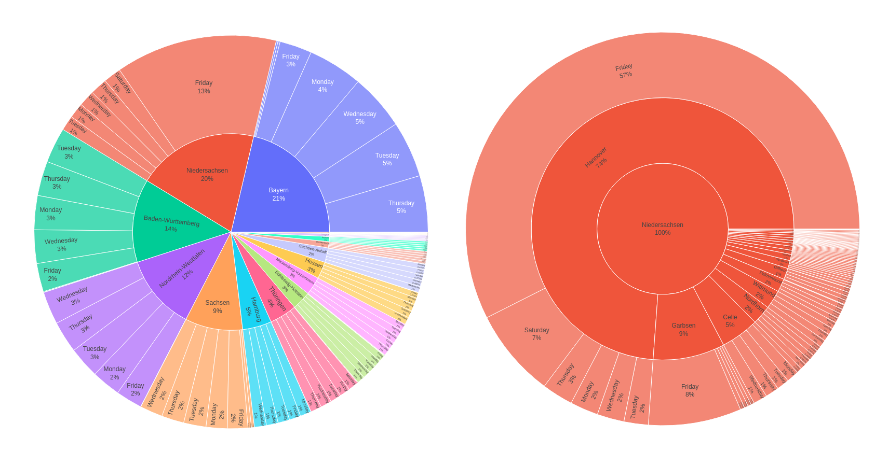
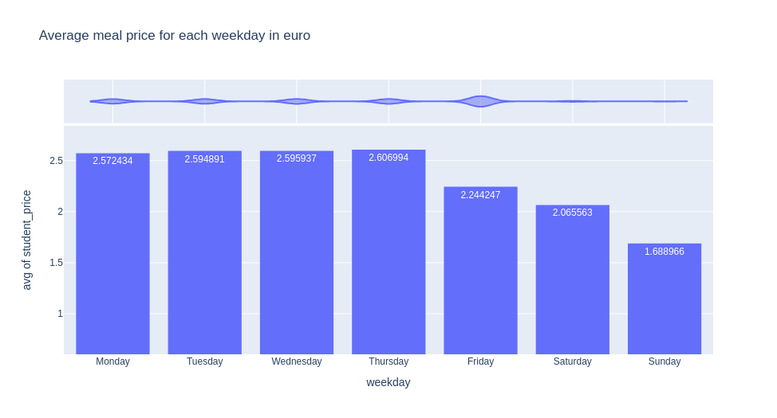
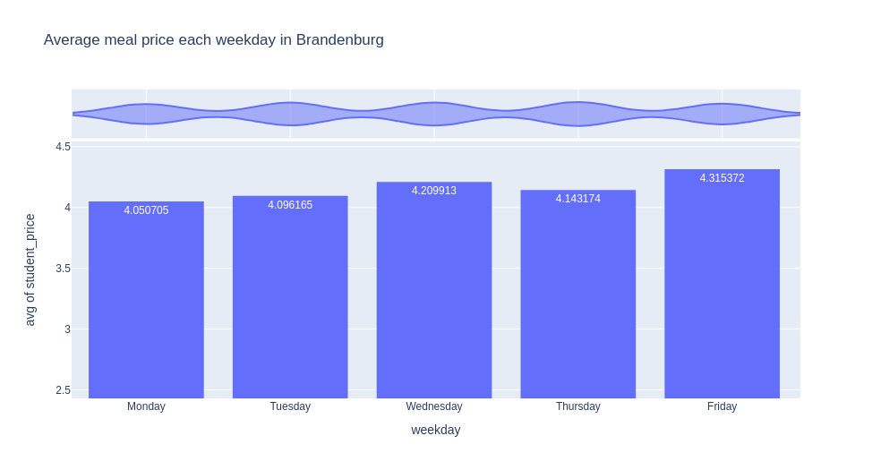
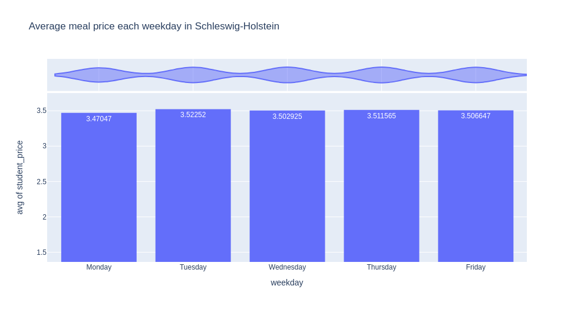
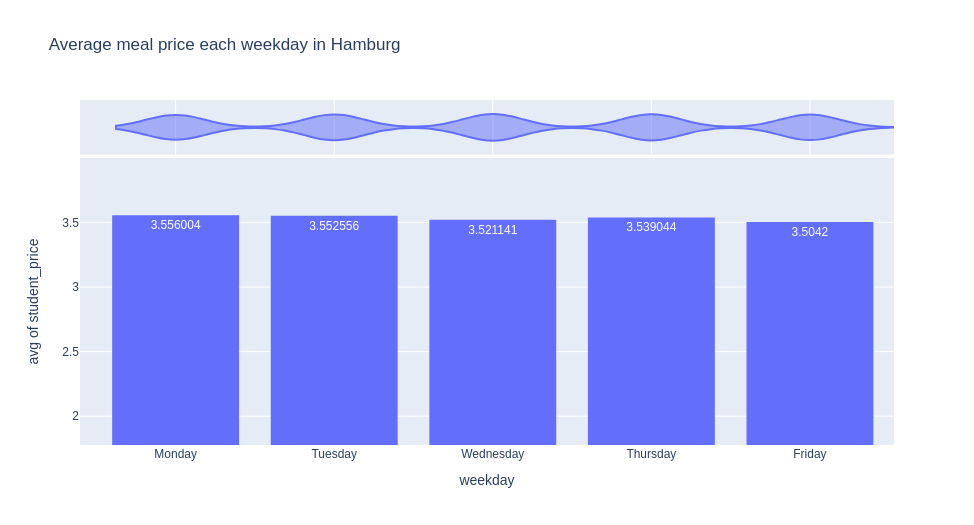
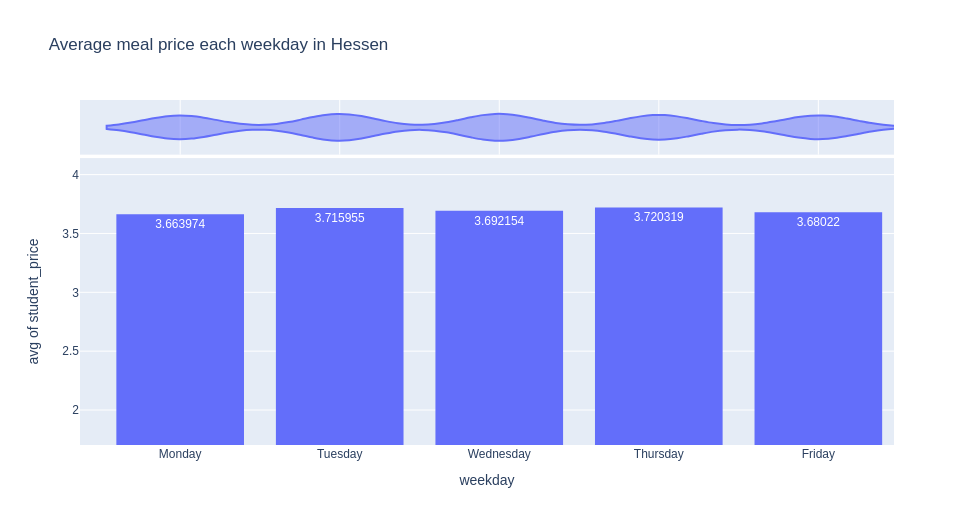
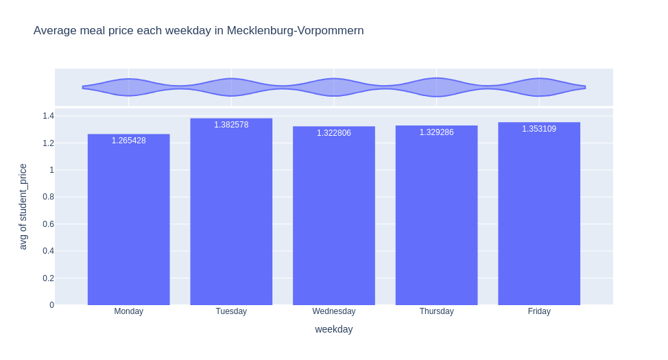
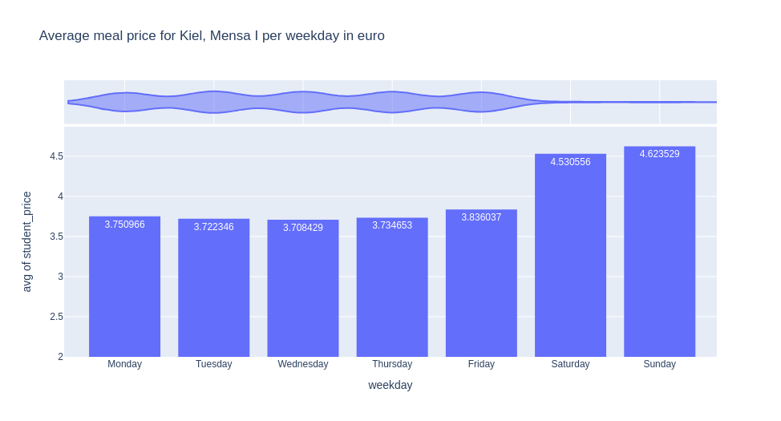
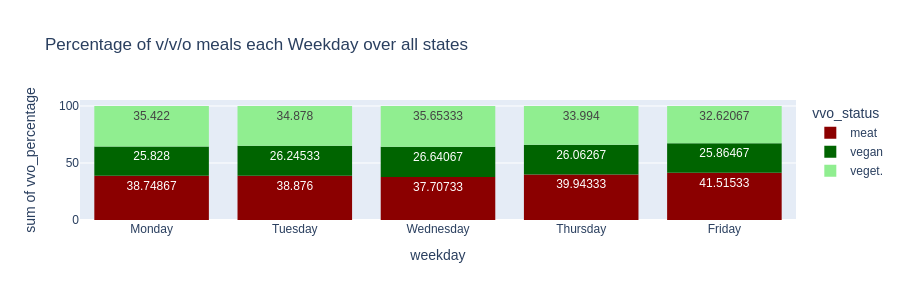
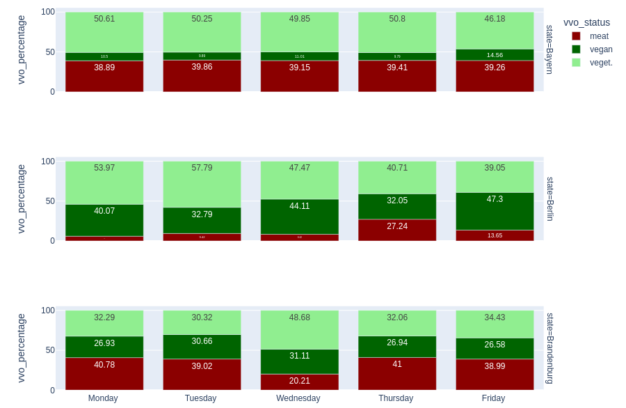

# Feeding the Academic Appetite: Price Dynamics and Dietary Trends of German Canteens

## Table of Contents

- [About this Project](#about-this-project)

## About this Project

This project aims to collect, analyze, and evaluate data from german educational canteens and cafeterias. The project primarily focuses on prices and the distribution of vegan, vegetarian, and meat/omnivorous dishes that are offered in the canteens. 

## Repository Structure 

### Directories

- [data](https://github.com/jonasweinschuetz/data_science_projekt/tree/main/data): contains the cleaned and transformed datasets used during data analysis as well as the raw data collected at the begining of our journey
- [data_acquisition](https://github.com/jonasweinschuetz/data_science_projekt/tree/main/data_acquisition): a collection of scripts used to collect the raw data
- [data_cleaning](https://github.com/jonasweinschuetz/data_science_projekt/tree/main/data_cleaning): a collection of scripts used to clean and transform the raw data, the main work is done by the *open-mensa-json-to-pandas-csv.py* script
- [app.py](https://github.com/jonasweinschuetz/data_science_projekt/blob/main/app.py) and [pages](https://github.com/jonasweinschuetz/data_science_projekt/tree/main/pages): files that belong to the dash application call this directory their home, *app.py* is the main script that launches the dash web app
- [presentation+poster](https://github.com/jonasweinschuetz/data_science_projekt/tree/main/presentation_and_poster): files related to the visualization of our findings, this includes the presentation slides and the poster

## The Data-Sets

The data primarily consist of two datasets: a smaller web-scraped dataset from universities in Schleswig-Holstein, which we scraped from the  [official website](https://studentenwerk.sh/de/mensen-in-kiel) of the state's student service, and a nationwide dataset collected using the [OpenMensa API](https://docs.openmensa.org/). The scraping began in mid-2022 and continued until early March 2024. The second dataset mostly extends only until the beginning of the year 2023; however, for the locations also represented in the first set, we collected retrospective data up to the year 2021 to gain a better understanding of long-term price trends. We would have liked to gather extensive data for the remaining canteens in Germany as well, but we decided against it, as the data collection process would otherwise have taken up too much time.

Each data point represents a dish that was offered on a particular day. Each entry includes the following details: 
- the unique ID of the canteen where the dish was sold
- the city where the canteen is located
- the unique ID of the dish within the location
- the name of the dish
- the date the dish was sold
- the price at which the dish was offered (for students, employees, and guests respectively)
- a list of tags providing additional information about the dish

Additionally, we also determined the corresponding federal state for each dish using Wikipedia's list of the German cities.

## Dependencies

This project uses Python 3.x and the following libraries:

- Pandas for data manipulation and analysis
- NumPy for numerical computations
- Matplotlib and Seaborn for data visualization
- Scikit-learn for machine learning and outlier detection

To install the dependencies, run the following command in your terminal or command prompt:

## Challenges 

### Data Collection

#### Web Scraping

The web-scraped dataset was obtained from one of our classmates, [Lia Lenckowski](https://github.com/llenck). Her web scraper queries the subpages of the Studentenwerk SH responsible for the meal plan of each university. Each of these subpages can be passed an argument representing one of the canteens that the university has. Then, only the container containing the meal table needs to be extracted from the received HTML, and the dishes are loaded into a JSON-lines file. Since the canteens always provide their weekly schedule, a request is made for each canteen of each university of the Studentenwerk once a week.

#### OpenMensa API

To build our dataset from the OpenMensa API, we first acquired a dataset containing all canteen locations and IDs (in total 1210) using its API, then mapped these to German cities and states using a dictionary created from scraping [Wikipedia's page of German cities](https://de.wikipedia.org/wiki/Liste_der_St%C3%A4dte_in_Deutschland). This allowed us to filter down to 687 canteens within Germany. Tackling the challenge of long request times and limited data retrieval (one day's meals per canteen ID per call), we automated the data collection process, running it continuously in multiple parallel processes on five Raspberry Pis. Specifically, we focused on collecting meal data from 2023 onwards for all German canteens and build a dedicated dataset for Schleswig-Holstein (SH) canteens starting from 2021 - the earliest data available for SH. Ultimately, we created three comprehensive datasets: one detailing Schleswig-Holstein canteens since 2021, a nationwide dataset from 2023, and a mapping of all German OpenMensa canteens with their respective locations (geo data) and IDs.

### Data Cleaning

The data cleaning process was relatively straightforward. To work with dish names and tags more effectively, we converted them to lowercase and filtered out line breaks and other special characters. The biggest issue we encountered was with prices. Unfortunately, there are canteens where one, two, or sometimes even all price tiers were missing. We suspect that this is due to some canteens, for example, having a single price for all their customers, which was then only recorded in the guest price line. We considered how to fill these gaps but ultimately decided not to consider missing prices for the respective price class calculation. 

It is particularly unfortunate that in the OpenMensa database, there were no data entries for Berlin and Bremen, which is why these two states cannot be found in our price statistics. 

The last point, which unfortunately came to our attention too late, is that in many canteens in Lower Saxony, almost 10 times as many dishes are found in the database on Fridays compared to the other weekdays. Unfortunately, we did not have the time to investigate potential causes of this phenomenon, but we had enough time to name it. Please keep the Lower Saxony Phenomenon in mind when reviewing weekday-specific data.

### Feature Engineering

The most challenging part was classifying the dishes into the three VVO categories (vegan, vegetarian, and omnivorous). The first issue was that not every canteen clearly defined the status of their dishes in the tag list. Often, tag lists are filled with allergy warnings or other additional information, or even left empty. Therefore, after using regular expressions to identify obvious keywords such as meat, vegan, vegetarian, we manually reviewed the remaining names and tag lists and searched for ingredients that indicated the VVO status of the dish. Among the remaining entries, we classified all dishes containing animals/meat ingredients in their names or tags. Then we repeated thios procedure for animal products. By applying this method several times, we managed to capture the majority of omnivorous and vegetarian dishes. However, since vegan dishes are defined by the absence of animal ingredients, it is difficult to capture them using this filtering method. Unfortunately, we cannot assume that all remaining dishes are vegan, as many non-vegan dishes do not have their animal ingredients listed in the name or tag list (e.g., Spaghetti Bolognese or Pizza Margherita). This was the second challenge we encountered. One could attempt to employ heuristics to capture a few more vegan dishes. For instance, dishes containing tofu or soy in the name that were not flagged as omnivorous or vegetarian could be classified as vegan. However, we opted against this approach because such rules either affected dishes already classified as vegan or posed the risk of incorrectly labeling potentially non-vegan dishes as vegan. Although we were unable to resolve this issue and vegan dishes may therefore be potentially underrepresented, we managed to classify 83.41% of our 700,958 dishes using this method.

## Website

Our very professional [web-application](https://data-science-projekt.onrender.com/)

# Research Questions

## 1. How has the average price for a meal in Schleswig-Holstein changed since 2021? 

### Exploring Meal Price Changes in Schleswig-Holstein Since 2021

To investigate the question of how meal prices of canteens have evolved in Schleswig-Holstein since 2021, we compiled a dataset from all canteens in the region. This dataset, which dates back to 2021, combines information from the OpenMensa API with data obtained through web scraping (see Data Collection). Over this period, the dynamics of meal pricing within Schleswig-Holstein's canteens have experienced noticeable shifts. In our analysis, we consider various factors: geographical (by city), status-based (student, employee, guest), and dietary categories (vegan, vegetarian, omnivorous). We aim to unravel the intricacies of these pricing adjustments.

#### Impact of Location on Price Change

Analysis of the average canteen meal pricing data across cities reveals that each city within Schleswig-Holstein has experienced significant price changes. Kiel, Flensburg, and Heide have seen a steady rise in meal prices. Lübeck, meanwhile, exhibits the smallest increase in prices in EUR terms, with only a marginally smaller percentage increase compared to the other cities. This suggests that, in general, local pricing in Lübeck has been more affordable.

**Average Price Change (Per Year Since 2021)**

| Location             | Price Increase (€/Year) | Percentage Increase (\%/Year) |
|----------------------|-------------------------|-------------------------------|
| Kiel:                | 0.41 €                  | 10.41 \%                      |
| Flensburg:           | 0.42 €                  | 11.05 \%                      |
| Lübeck:              | 0.16 €                  | 8.67 \%                       |
| Heide:               | 0.47 €                  | 9.36 \%                       |
| **Schleswig-Holstein:** | 0.36 €              | 9.87 \%                       |

In 2022 and 2023, canteen meal prices in Schleswig-Holstein (SH) rose noticeably, yet remained below the national food inflation rate. Despite the significant differences observed between cities across these years, an overarching trend of increasing prices is evident.

**Annual Price Changes (2022 and 2023)**
| Location          | 2022   | 2023  |
|-------------------|-------|-------|
| Kiel:             | 8.7 %  | 12.4 % |
| Flensburg:        | 1.7 %  | 9.8 %  |
| Lübeck:           | 15.8 % | 6.8 %  |
| Heide:            | 11.8 % | 12.2 % |
| **SH:**           | 9.5 %  | 10.3 % |
| **Food Inflation:** | 13.4 % | 12.4 % |

_Food Inflation = Germany-wide food inflation rate ([destatis.de](https://destatis.de))_

### Impact of Visitor Status on Price Change

An in-depth examination of meal price changes in canteens based on visitor status (student, employee, guest) reveals differentiated impacts. Guests experienced an annual increase of 10.92 % (0.47 €), employees saw a 10.47 % rise (0.42 €), and students encountered the steepest increase at 10.94 % (0.31 €). This tiered pricing model demonstrates the canteens' attempts to maintain affordability amidst inflation, tailored for students, employees, and guests.

### Impact of Dietary Categories on Price Change

Further analysis delves into price variations across dietary categories: vegan, vegetarian, and meat-based meals. Surprisingly, vegan meals underwent the highest price adjustments, followed by meat-based and then vegetarian options. Specifically, vegan dishes experienced an average annual price increase of 18.33 % (0.54 €), with meat-based (16.84 %, 0.67 €) and vegetarian (15.41 %, 0.48 €) meals seeing more modest rises. The graph below illustrates the substantial price volatility of vegan meals compared to meat-based options, potentially reflecting the increasing costs of vegan food production and a growing demand for plant-based diets among students.

### Conclusion

Our comprehensive analysis of meal price changes in Schleswig-Holstein's canteens since 2021 highlights several key trends. Geographical location, visitor status, and dietary choices significantly influence price adjustments, with vegan meals experiencing the highest increases. Despite the inflationary pressures, canteen meal prices in the region have generally remained below the national food inflation rate, suggesting efforts by canteen operators to keep meals accessible to their primary clientele. As dietary habits continue to evolve and economic conditions change, these trends offer valuable insights for diverse and economically sensitive people such as students, employees, and guests in educational institutions.

## 3. How has the average price for a meal in Germany changed since 2023? 

### Exploring Meal Price Changes in Germany Since 2023

To explore this research question we build a data set for all canteens in Germany. This data set dates back to 1.1.2023 and is from the OpenMensa API. Since 2023, the dynamics of meal pricing within Germanys canteens have undergone some changes.

### Average Data

This table illustrates the absolute price changes for different price categories. The 'Student Price' experienced a modest increase of 0.13 € since 2023, while the 'Employee Price' saw a slightly larger increase of 0.19 € during the same period. Notably, the 'Guest Price' exhibited the highest absolute change, rising by 0.33 €. 

| Price Category   | Absolute Price Change |
|------------------|-----------------------|
| Student Price    | 0.13 €                |
| Employee Price   | 0.19 €                |
| Guest Price      | 0.33 €                |

### Trend Data

| Price Category   | Percentage Change |
|------------------|-------------------|
| Student Price    | 5.60 %            |
| Employee Price   | 6.30 %            |
| Guest Price      | 9.30 %            |

This table showcases the percentage changes in prices across different categories. The 'Student Price' witnessed a modest increase of 5.60%, reflecting moderate inflationary pressures since 2023. In comparison, the 'Employee Price' saw a slightly higher percentage rise of 6.30%, indicating a marginally greater impact on this category. Remarkably, the 'Guest Price' experienced the most significant percentage change, soaring by 9.30%.

### Combined Data

| **Average price change since 2023 (absolute)** |      |
|-----------------------------------------------|------|
| **Student Price:**                            | 0.13 €, or 5.60 \%  |
| **Employee Price:**                           | 0.19 €, or 6.30 \%  |
| **Guest Price:**                              | 0.33 €, or 9.30 \%  |

## 4. Does the day of the week influence average meal prices?

For this section we focused on the student prices.

### On the country scale 
At first glance, it is apparent that Friday, Saturday, and Sunday are by far the most affordable days of the week. As evidenced by the violin plot, Saturdays and Sundays are significantly underrepresented in the dataset, which likely renders the average prices for this days non-representative. Conversely, Fridays are overrepresented due to the Lower Saxony Phenomenon mentioned earlier, leading to the overrepresentation of prices in Lower Saxony for Friday and consequently pulling down the overall average. The price differences on the remaining weekdays are minimal and are most likely due to statistical noise :/

### On the state level 

Our next step was to look for patterns on a finer scale, so we generated the previous plot for each federal state. Saturdays and Sundays continue to be outliers. This is likely because they adhere to the average prices of canteens offering weekend dishes. Accordingly, these two days are sometimes more expensive and sometimes cheaper than weekdays.
 
For the working week days we firstly tried to locate weekdays that differ at least 5% from the week mean. Only Lower Saxony had weekdays that met this criterium.  
When glancing over the average weekday prices for each state there is no aperent strong trend visible. Some states have price jump of around 5 cents on Mondays or Fridays when compared to the weekly average, but this can be explained with statistical variance. One day that raised our interest was the Friday in Brandenburg. It is 15 cent more expensive compared to the work-week average in Brandenburg. In order to get a better idea for the data, we will show some handselected plots where the y-axis has been scaled in a way that highlights the otherwhise barely visible changes in price.

## 5. Does the weekday influence the availability of dietary options in German canteens?

Firstly, we examined the distribution of the three VVO categories per weekday for our entire dataset. 

As expected, the distribution was fairly even. This is likely because patterns created by local regulations at the canteen level (e.g., Vegetarian Monday) tend to 'cancel out' when aggregated. Therefore, our next step was to take a closer look at our data and consider the canteens on a state level. Here two patterns emerged. In many countries (here, for example, Bavaria), the distribution remained fairly even. However, a surprising number of states had days with distinct outliers in their distribution (symbolized by Berlin and Brandenburg). These outliers are larger than can be explained by statistical noise. The hypothesis that in these states, canteens collectively offer fewer meat dishes on certain days is plausible. It is noteworthy that Berlin is the only one of these states where the outlier day has an increased offering of meat dishes.

But this was not enough, we wanted to dig deeper. 

## Research Question 7: Does a university’s location influence the average price of meals for students?

### Impact of University Location on Student Meal Prices

Displayed in this graphic are the 100 most expensive and cheapest canteens in Germany. Notably, there is some overlap among these establishments. When accounting for the entire range, the cheapest canteens predominantly cluster in Lower Saxony and North Rhine-Westphalia, particularly along the border with the Netherlands. Surprisingly, numerous affordable university canteens are situated in the southern regions. Conversely, the most expensive canteens tend to be located in the south near the French border, with additional high-priced options in Schleswig-Holstein and throughout central Germany.

### Most Expensive University Canteens:

This reveals the top five most expensive canteens in Germany, led by Tossingen, situated in Baden-Württemberg.

### Most Budget-Friendly University Canteens:

This highlights the five most affordable university canteens, with Heidelberg Zeighaus leading the list with a notably low price of 1.1€

### Key Finding:

Significant disparities exist in student meal prices across different German states.

Interestingly, we observe no distinct east-west divide in the pricing patterns, contrary to prior expectations. While the southern German states tend to have slightly higher prices overall, it's noteworthy that some of the cheapest canteens also hail from the southern regions. This suggests a nuanced landscape where geographical location does not strictly dictate pricing.

